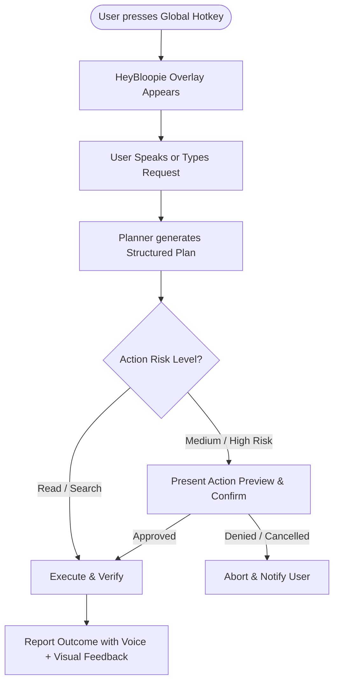

# Product Requirements Document (PRD) — HeyBloopie

## 1. Executive Summary
**HeyBloopie** is an intelligent, privacy-first desktop AI agent designed specifically for Windows. Activated seamlessly via a global hotkey, HeyBloopie allows users to interact through voice or text to automate local file operations—finding, organizing, bulk renaming, moving, and summarizing files and directories. Rather than acting as an opaque black box, HeyBloopie functions as a dependable executive assistant that provides clear previews, verifies outcomes, maintains strict safety boundaries, and honestly informs the user when a request falls outside its capabilities.

---

## 2. Problem Statement: Digital Friction
Every day, computer users lose compounding hours to digital friction:
- **Disorganized Files:** Desktop clutter, bloated `Downloads` folders, and fragmented project directories.
- **Tedious Repetition:** Manually renaming dozens of receipts, photos, or invoices one-by-one.
- **Search Inefficiencies:** Inability to quickly locate files based on loose fuzzy content descriptions, creation windows, or semantic context.
- **Workflow Interruption:** Switching context away from primary tasks just to find, move, or clean up folders.

Current operating system tools require exact names or complex syntax. HeyBloopie bridges the gap by translating natural human intent into verified, deterministic file-system actions.

---

## 3. Target User Persona
- **Primary Audience:** Non-technical Windows users (knowledge workers, students, creators, office professionals) who deal with a high volume of files daily.
- **User Characteristics:**
  - Prefers simple, conversational instructions over complex scripts, terminal commands, or nested GUI menus.
  - Demands safety and predictability (cannot afford accidental file deletion or misplacement).
  - Values immediate feedback, responsiveness, and minimal system resource footprint.

---

## 4. Core Value Proposition
1. **Intention to Verified Outcome:** Translates natural language ("Organize my Downloads folder by file type and date") into a multi-step plan, previews the exact changes, executes them safely, and validates the result.
2. **Transparency & Previews:** No silent mutations. Users see proposed changes before they execute.
3. **Honest Limits:** If a task cannot be performed accurately or exceeds system permissions, HeyBloopie immediately and honestly communicates what it cannot do rather than hallucinating or executing unsafe guesses.
4. **Lightweight & Instant:** Always available in the background, low memory footprint, sub-second voice interaction.

---

## 5. Scope Boundaries

### 5.1 In-Scope (V1 Capabilities)
- **File Discovery & Search:**
  - Locate files by name, fuzzy matching, extension, modification/creation dates, and file content snippets.
- **Folder Organization & Structure:**
  - Group and organize directories based on file types, dates, or custom user criteria.
  - Create new folder hierarchies on demand.
- **Bulk Operations:**
  - Bulk rename files following dynamic naming patterns, timestamps, or content themes.
  - Move or copy files across approved directories.
- **Inspection & Summarization:**
  - Read and display file metadata (size, created/modified dates, extension, permissions).
  - Explain and summarize folder contents in plain English.
  - Read text-based file contents for summarization or search verification.
- **Multimodal Interaction:**
  - Global hotkey invocation.
  - Voice input (Speech-to-Text) and natural voice output (Text-to-Speech).
  - Clean floating text input/output interface.

### 5.2 Out-of-Scope (V1 Non-Goals)
- **Browser Automation:** No web browsing, web scraping, or browser extension control.
- **Communication Tools:** No email drafting/sending, messaging app integration, or calendar scheduling.
- **Computer Vision & Peripherals:** No camera capture, screen recording, or active screen OCR understanding.
- **Software Engineering / Coding:** No code generation, IDE integrations, or script execution engines.
- **Multi-Agent Orchestration:** No complex autonomous sub-agent swarms.
- **Cloud Sync & Dependencies:** No mandatory cloud storage, multi-device syncing, or telemetry locking. Local-first execution.

---

## 6. Key Success Metrics & Targets

| Metric | Target | Description |
| :--- | :--- | :--- |
| **Verified Task Completion Rate** | **> 95%** | Percentage of user requests that result in fully verified and accurate file actions. |
| **False Completion Rate** | **< 1%** | Percentage of actions reported as successful that were actually incorrect or failed. |
| **Voice Latency** | **< 1.0 s** | Time elapsed from the end of user speech to the first streaming audio/text response. |
| **Time to First Value (TTFV)** | **< 60 s** | Time from first launch for a new user to complete their first successful file operation. |
| **Idle Memory Usage** | **< 100 MB** | Base RAM footprint when idle in the Windows system tray. |

---

## 7. User Experience Flow

